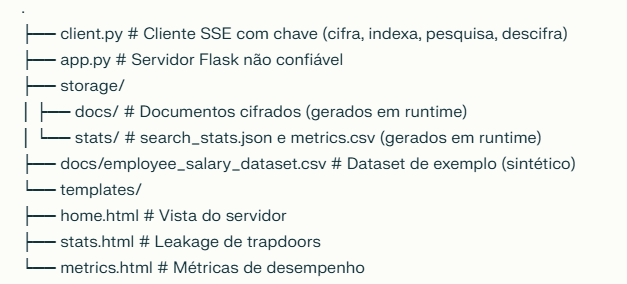

# RH‑SecureSearch – Protótipo de Searchable Symmetric Encryption

Protótipo de um sistema de pesquisa por palavra‑chave sobre dados cifrados, baseado em Searchable Symmetric Encryption (SSE), aplicado a um dataset exemplo de Recursos Humanos com salários mensais. O objetivo é demonstrar como um servidor não confiável consegue processar pesquisas sem acesso aos dados pessoais em claro, alinhado com os princípios do RGPD. [file:207]

## Arquitetura em alto nível

O sistema segue um modelo **cliente–servidor**:

- **Cliente (aplicação de RH)**  
  - Script `client.py`.  
  - Gera e guarda localmente uma `master.key`.  
  - Lê o ficheiro CSV com dados de funcionários (inclui salários).  
  - Cifra os registos com AES‑GCM e constrói um índice invertido SSE:  
    - extrai keywords dos textos (ex.: “Marketing”, “Bangalore”)  
    - gera trapdoors com HMAC‑SHA256 (`keyword → trapdoor`)  
    - associa `trapdoor → lista de docIds`.  
  - Envia para o servidor apenas:  
    - índice `trapdoor → [docIds]`  
    - documentos cifrados `docId → {nonce, ciphertext}`.  
  - Nas pesquisas:
    - gera o trapdoor da keyword (ex.: “Marketing”)  
    - envia só o trapdoor para o servidor  
    - recebe documentos cifrados correspondentes  
    - descifra localmente e mostra o texto completo ao utilizador (incluindo salários). [file:207]

- **Servidor (não confiável)**  
  - Aplicação Flask (`app.py`).  
  - Não tem acesso à `master.key`.  
  - Armazena apenas:
    - `storage/docs/*.json` – documentos cifrados  
    - `storage/index.json` – índice `trapdoor → [docIds]`  
    - `storage/stats/search_stats.json` – nº de pesquisas por trapdoor (leakage)  
    - `storage/stats/metrics.csv` – tempos de build, upload e pesquisa.  
  - Endpoints principais:
    - `POST /upload` – recebe índice e documentos cifrados do cliente  
    - `POST /search` – recebe um trapdoor e devolve docIds + blobs cifrados  
    - `GET /` – vista do servidor (mostra apenas o que o servidor sabe)  
    - `GET /stats` – leakage de pesquisas (trapdoors e contagens)  
    - `GET /metrics` – métricas de desempenho. [file:207]

Este desenho separa claramente a **aplicação com chave** (cliente) da **infraestrutura não confiável** (servidor), reduzindo o risco de exposição de dados pessoais e cumprindo princípios de minimização, integridade e confidencialidade. [file:207]

## Requisitos

- Python 3.10+  
- Bibliotecas Python:
  - `flask`
  - `requests`
  - `cryptography`
Sugestão de `.gitignore` (não incluir dados sensíveis nem artefactos gerados):

## Estrutura do repositório

## Como correr a demo

### 1. Instalar dependências
pip install -r requirements.txt

### 2. Arrancar o servidor (não confiável)
python app.py
O servidor fica, por omissão, em `http://127.0.0.1:5000/`.

### 3. Construir o índice e enviar dados cifrados (lado cliente)
Noutro terminal, na raiz do projeto: 
python client.py build-and-upload docs/employee_salary_dataset.csv

Este passo:

- gera (ou reutiliza) `master.key` no cliente  
- lê o CSV de RH  
- cifra cada registo  
- constrói o índice SSE  
- faz upload cifrado para o servidor  
- regista tempos de build e upload em `storage/stats/metrics.csv`.

### 4. Efetuar pesquisas seguras (lado cliente)
Exemplo de pesquisa por departamento:
python client.py search "Marketing"

O cliente:

- gera trapdoor para “Marketing”  
- envia trapdoor ao servidor  
- recebe os documentos cifrados correspondentes  
- descifra localmente e mostra frases como:

> Funcionario emp_500 trabalha no departamento Marketing ... salario mensal 121752.

Também regista tempos de pesquisa em `metrics.csv`.

### 5. Explorar as vistas web (lado servidor)

No browser:

- `http://127.0.0.1:5000/`  
  - “Vista do servidor”: pequena pesquisa ilustrativa e explicação de que o servidor não tem acesso aos salários em claro.  
- `http://127.0.0.1:5000/stats`  
  - Tabela com trapdoors e nº de vezes pesquisadas, ilustrando leakage de padrão de pesquisa (o servidor aprende que certos trapdoors são frequentes, mas não sabe a palavra original).  
- `http://127.0.0.1:5000/metrics`  
  - Tabela com tempos de build, upload e pesquisa, para análise de desempenho e comparação com pesquisa em claro.  

---

## Limitações e trabalho futuro

- O esquema SSE usado é básico (trapdoors independentes por keyword, sem otimizações avançadas de estrutura de dados).  
- Não cobre ataques de inferência mais sofisticados baseados em correlação entre padrões de acesso e distribuição de termos.  
- O cliente é um script de linha de comando; poderia evoluir para uma aplicação com interface gráfica ou integração numa aplicação web separada, mantendo sempre a chave apenas no lado cliente. [file:207]

Este protótipo serve como base experimental para o relatório do trabalho prático, onde se discute a literatura sobre SSE, o impacto em desempenho, riscos de leakage e implicações de privacidade no contexto do RGPD. [file:207]

